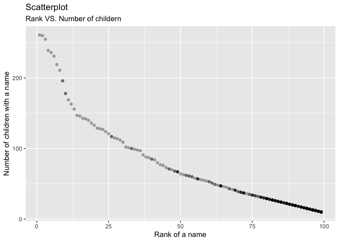

homework2
================
Jialiang Hua

``` r
library(tidyverse)
library(readxl)
```

## Problem 1

Read the Mr. Trash Wheel dataset.

``` r
trashwheel_df <- 
  read_excel(
    "./data/Trash-Wheel-Collection-Totals-7-2020-2.xlsx", 
    sheet = "Mr. Trash Wheel", 
    range = "A2:N534") %>% 
  janitor::clean_names() %>% 
  drop_na(dumpster) %>% 
  mutate(sports_balls = round(sports_balls))
```

Read and clean precipitation data for 2018 and 2019

``` r
precip18_df <-
  read_excel(
    "./data/Trash-Wheel-Collection-Totals-7-2020-2.xlsx", 
    sheet = "2018 Precipitation",
    skip = 1) %>%
  janitor::clean_names() %>% 
  drop_na(month) %>% 
  mutate(year = 2018) %>% 
  relocate(year)

precip19_df <-
  read_excel(
    "./data/Trash-Wheel-Collection-Totals-7-2020-2.xlsx", 
    sheet = "2019 Precipitation",
    skip = 1) %>%
  janitor::clean_names() %>% 
  drop_na(month) %>% 
  mutate(year = 2019) %>% 
  relocate(year)
```

Now combine precipitation datasets

``` r
precip_df <-
  bind_rows(precip18_df, precip19_df) %>% 
  mutate(month = month.name[month])
```

The first data set was generated by Mr. Trashwheel trash collector in
Baltimore, Maryland. It includes the information of trash entering,
collection and dumpster storage. The dataset contains information on
dumpster, month, year, date, weight\_tons, volume\_cubic\_yards,
plastic\_bottles, polystyrene, cigarette\_butts, glass\_bottles,
grocery\_bags, chip\_bags, sports\_balls, homes\_powered. There are a
total of 453 rows in the final dataset.

The second data set was the month precipitation data in 2018 and 2019.
The dataset contains information on year, month, total. There are a
total of 24 rows in the final dataset.

-   The total precipitation in 2018 was 70.33 inches.
-   The median number of sports balls in a dumpster in 2019 was 9

## Problem 2

First, clean the data in pols-month.csv

``` r
pols_month_df <-
  read_csv("./data/fivethirtyeight_datasets/pols-month.csv") %>% 
  janitor::clean_names() %>% 
  separate(mon, sep = "-", into = c("year", "month", "day")) %>% 
  mutate(
    year = as.integer(year),
    month = as.integer(month), 
    day = as.integer(day),
    month = month.name[month],
    president = ifelse(prez_gop == 0, "dem", "gop")
  ) %>% 
  select(-day,  -prez_gop, -prez_dem) %>% 
  relocate(year, month, president)
```

    ## Rows: 822 Columns: 9

    ## ── Column specification ────────────────────────────────────────────────────────
    ## Delimiter: ","
    ## dbl  (8): prez_gop, gov_gop, sen_gop, rep_gop, prez_dem, gov_dem, sen_dem, r...
    ## date (1): mon

    ## 
    ## ℹ Use `spec()` to retrieve the full column specification for this data.
    ## ℹ Specify the column types or set `show_col_types = FALSE` to quiet this message.

Second, clean the data in snp.csv

``` r
snp_df <- 
  read_csv("./data/fivethirtyeight_datasets/snp.csv") %>% 
  janitor::clean_names() %>% 
  mutate(date = lubridate::mdy(date)) %>% 
  separate(date, into = c("year", "month", "day")) %>% 
  mutate(year = as.integer(year),
         month = as.integer(month),
         day = as.integer(day),
         month = month.name[month]) %>% 
  select(-day) %>% 
  arrange(year, month) %>% 
  relocate(year, month)
```

    ## Rows: 787 Columns: 2

    ## ── Column specification ────────────────────────────────────────────────────────
    ## Delimiter: ","
    ## chr (1): date
    ## dbl (1): close

    ## 
    ## ℹ Use `spec()` to retrieve the full column specification for this data.
    ## ℹ Specify the column types or set `show_col_types = FALSE` to quiet this message.

Third, tidy the unemployment data

``` r
unemployment_df <- 
  read_csv("./data/fivethirtyeight_datasets/unemployment.csv") %>% 
  pivot_longer(Jan:Dec, 
               names_to = "month", 
               values_to = "unemployment") %>% 
  janitor::clean_names() %>% 
  mutate(month = match(month, month.abb),
         month = month.name[month],
         year = as.integer(year))
```

    ## Rows: 68 Columns: 13

    ## ── Column specification ────────────────────────────────────────────────────────
    ## Delimiter: ","
    ## dbl (13): Year, Jan, Feb, Mar, Apr, May, Jun, Jul, Aug, Sep, Oct, Nov, Dec

    ## 
    ## ℹ Use `spec()` to retrieve the full column specification for this data.
    ## ℹ Specify the column types or set `show_col_types = FALSE` to quiet this message.

Join the datasets by merging snp into pols, and merging unemployment
into the result

``` r
pols_snp_unemploy_df <- 
  left_join(pols_month_df, snp_df, by = c("year", "month")) %>% 
  left_join(unemployment_df, by = c("year", "month"))
```

For the pols-months data set, it contains 822 observations with 9
variables which are respectively year, month, president, gov\_gop,
sen\_gop, rep\_gop, gov\_dem, sen\_dem, rep\_dem. The range of years is
from 1947 to 2015.

For the snp data set, it contains 787 observations with 3 variables
which are respectively year, month, close. The range of years is from
1969 to 2015.

For the unemployment data set, it contains 816 observations with 3
variables which are respectively year, month, unemployment. The range of
years is from 1948 to 2015.

As for the merging data set, it contains 822 observations with 11
variables which are respectively year, month, president, gov\_gop,
sen\_gop, rep\_gop, gov\_dem, sen\_dem, rep\_dem, close, unemployment

## Problem 3

Load and tidy the data

``` r
popular_baby_names_df <- read_csv("./data/Popular_Baby_Names.csv") %>% 
  janitor::clean_names() %>% 
  drop_na() %>% 
  mutate(
    gender = tolower(gender),
    childs_first_name = tolower(childs_first_name),
    childs_first_name = Hmisc::capitalize(childs_first_name),
    ethnicity = recode(
      ethnicity,
      "ASIAN AND PACI" = "ASIAN AND PACIFIC ISLANDER",
      "BLACK NON HISP" = "BLACK NON HISPANIC",
      "WHITE NON HISP" = "WHITE NON HISPANIC"
    ),
    ethnicity = toupper(ethnicity)
  ) %>% 
  distinct()
```

Produce table showing the rank of female name “Olivia”

``` r
olivia_df <- 
  filter(popular_baby_names_df, childs_first_name == "Olivia" & gender == "female") %>% 
  select(-count) %>% 
  pivot_wider(
    names_from = "year_of_birth",
    values_from = "rank"
  ) %>% 
  relocate(c(1:3), c(9:4))
olivia_df %>% 
  knitr::kable()
```

| gender | ethnicity                  | childs\_first\_name | 2011 | 2012 | 2013 | 2014 | 2015 | 2016 |
|:-------|:---------------------------|:--------------------|-----:|-----:|-----:|-----:|-----:|-----:|
| female | ASIAN AND PACIFIC ISLANDER | Olivia              |    4 |    3 |    3 |    1 |    1 |    1 |
| female | BLACK NON HISPANIC         | Olivia              |   10 |    8 |    6 |    8 |    4 |    8 |
| female | HISPANIC                   | Olivia              |   18 |   22 |   22 |   16 |   16 |   13 |
| female | WHITE NON HISPANIC         | Olivia              |    2 |    4 |    1 |    1 |    1 |    1 |

Produce a similar table showing the most popular name among male
children over time

``` r
popmale_df <- 
  filter(popular_baby_names_df, gender == "male" & rank == 1) %>% 
  select(-count & -rank) %>% 
  pivot_wider(
    names_from = "year_of_birth",
    values_from = "childs_first_name"
  ) %>% 
  relocate(1, 2, c(8:3))
popmale_df %>% 
  knitr::kable()
```

| gender | ethnicity                  | 2011    | 2012   | 2013   | 2014   | 2015   | 2016   |
|:-------|:---------------------------|:--------|:-------|:-------|:-------|:-------|:-------|
| male   | ASIAN AND PACIFIC ISLANDER | Ethan   | Ryan   | Jayden | Jayden | Jayden | Ethan  |
| male   | BLACK NON HISPANIC         | Jayden  | Jayden | Ethan  | Ethan  | Noah   | Noah   |
| male   | HISPANIC                   | Jayden  | Jayden | Jayden | Liam   | Liam   | Liam   |
| male   | WHITE NON HISPANIC         | Michael | Joseph | David  | Joseph | David  | Joseph |

Produce a scatter plot

``` r
# Select the data for plotting
scatterplot_df <- 
  filter(
    popular_baby_names_df, 
    gender == "male" & ethnicity == "WHITE NON HISPANIC" & year_of_birth == 2016)

# Let's plot!!
scatterplot_df %>% 
  ggplot(aes(x = rank, y = count)) + 
  geom_point(alpha = .3) + 
  labs(
    title = "Scatterplot",
    subtitle = "Rank VS. Number of childern",
    x = "Rank of a name",
    y = "Number of children with a name"
  )
```

<!-- -->
